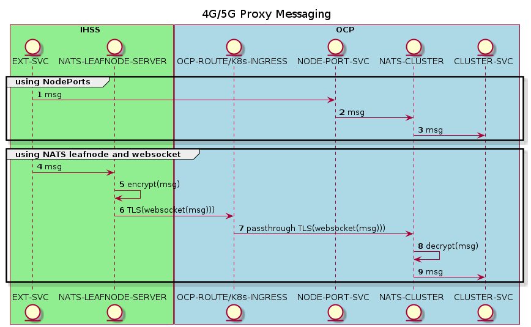

# nats-k8s-leafnode-websocket
## Description
### What
Demonstration of how to connect a NATS leafnode to a NATS cluster using secure websockets. 
### Why
Part of the NATS TLS HandShake is in plain text. This results in a major inconvenience if the NATS cluster has to be exposed via secure ingress, OpenShift secure route etc. There are a couple of ways to alleviate the issue
* Poke a hole in the cluster by exposing an insecure NodePort
* Install TLS enabled proxies (HAProxy, envoy etc) inside and outside the cluster to provide a secure tunnel for NATS traffic
* Employ an edge NATS server (leaf node) that communicates securely with the main NATS cluster
### How
The NATS "way" is to to enable websockets + TLS on the main NATS cluster. The main NATS cluster communicates with the leaf node) via Secure WebSocket via TLS / Seure WebSockets



## Prerequisites
* This guide assumes that a working K8s cluster is available. My recommendation for a personal "real" k8s distribution is [k3s](https://k3s.io/)
* A nats-server binary to serve as the leaf node. Alternative approaches to set up a leaf node could involve a NATS cluster, or a docker instace of NATS running as a leaf node. A binary was chosen for this demo for simplicity. 
    * If needed, download the nats-server binary from https://github.com/nats-io/nats-server/releases
* [mkcert](https://github.com/FiloSottile/mkcert) is used to generate the required certificates and will need to be installed


## Procedure
For this demonstration, the leaf node will be configured to connect to the main NATS cluster's **NodePort** via Secure WebSockets. In a real life use-case, the connection would likely be tunneled via a secure access such as an OCP route
* Execute `./create-certs.sh` to create the necessary keys, certificates and import into K8s as secrets

* Install nats in K8s with leaf node and websockets enabled using the values file provided in this tutorial`helm install nats nats/nats -f values.yml`
* Create a NodePort service to expose NATS via NodePort for demonstration purposes `kubectl apply -f nats-public.yaml` . Be sure to note the public NodePort port.
* Configure the NodePort port in `nats-leafnode.conf`
* Start the leaf node server configured to listen on port `4111` and connect to the main NATS server using Secure WebSockets on the NodePort described above `./nats-server -DVV -c nats-leafnode.conf`

* Subscribe to messages via the main NATS cluster
```
$ kubectl get svc 
NAME          TYPE        CLUSTER-IP     EXTERNAL-IP   PORT(S)                                                         AGE
kubernetes    ClusterIP   10.43.0.1      <none>        443/TCP                                                         27d
nats-public   NodePort    10.43.168.26   <none>        4222:30065/TCP,443:32597/TCP                                    25d
nats          ClusterIP   None           <none>        443/TCP,4222/TCP,6222/TCP,8222/TCP,7777/TCP,7422/TCP,7522/TCP   6d15h
$ nats sub -s nats://localhost:30065 test.topic
11:30:54 Subscribing on test.topic
[#1] Received on "test.topic"
hello world ========================================> rcvd the published message
=======

```
* Publish via the leaf node which relays the payload to the main NATS cluster via Secure Websockets 
```
$ nats pub -s nats://localhost:4111 test.topic "hello world"
11:32:03 Published 11 bytes to "test.topic" =======> publish a message
```
## Cleanup
* `./cleanup.sh`
